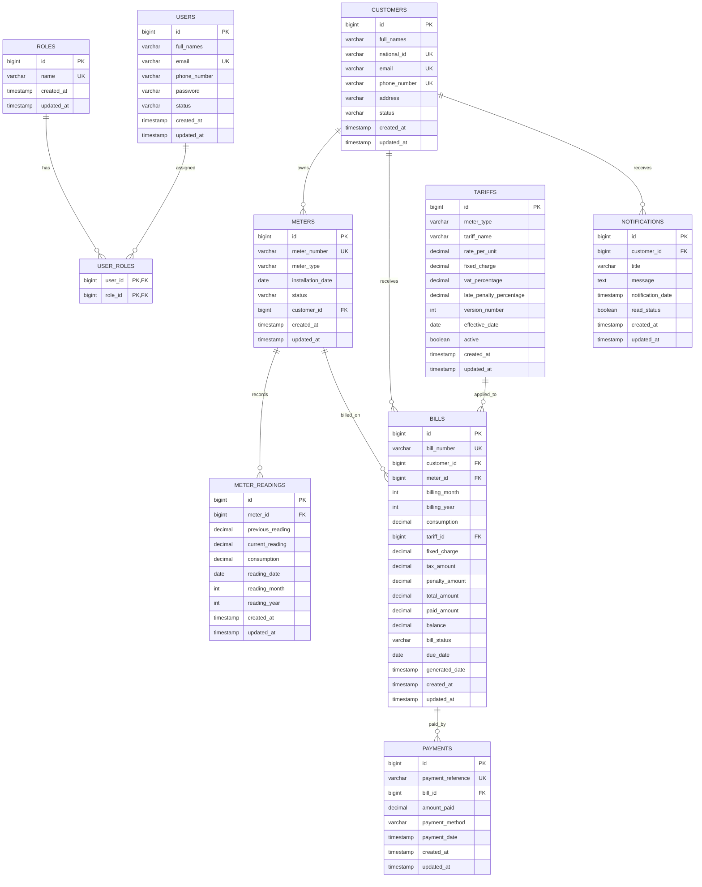

# Utility Billing System - Entity Relationship Diagram

## Overview

The Utility Billing System manages utility customers, meters, readings, tariffs, billing, payments, and notifications with role-based user authentication.

## ERD (Mermaid)

## Entity Relationships

| Parent | Child | Cardinality | Description |
|--------|-------|-------------|-------------|
| USERS | USER_ROLES | 1:N | Users can have multiple roles |
| ROLES | USER_ROLES | 1:N | Roles assigned to many users |
| CUSTOMERS | METERS | 1:N | One customer can own multiple meters |
| METERS | METER_READINGS | 1:N | One reading per meter per month/year |
| CUSTOMERS | BILLS | 1:N | Customer receives multiple bills |
| METERS | BILLS | 1:N | Bills generated per meter per period |
| TARIFFS | BILLS | 1:N | Tariff version snapshot on each bill |
| BILLS | PAYMENTS | 1:N | Bills can have partial/full payments |
| CUSTOMERS | NOTIFICATIONS | 1:N | Notifications sent to customers |

## Database Routines

| Routine | Type | Purpose |
|---------|------|---------|
| `calculate_utility_charges()` | Function | Computes subtotal, VAT, and total |
| `generate_monthly_bills()` | Stored Procedure | Cursor-based monthly bill generation |
| `trg_bill_generated_notification()` | Trigger | Auto-notify on bill insert |
| `trg_bill_paid_notification()` | Trigger | Mark PAID and notify on zero balance |
| `trg_calculate_consumption()` | Trigger | Auto-calculate consumption on reading |
