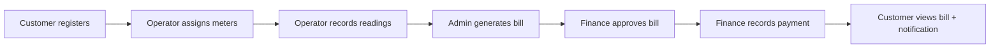

# 15-Minute Swagger Testing Guide
## WASAC/REG Utility Billing System

**Swagger URL:** http://localhost:8080/api/swagger-ui.html  
**All seeded passwords:** `Admin@12345`

---

## How the system works (read this first — 2 min)



| Role | What they do in the system |
|------|---------------------------|
| **CUSTOMER** | Self-register, view/update profile, view own bills & payments |
| **OPERATOR** | Manage meters, capture readings, activate/deactivate customers |
| **ADMIN** | Configure tariffs, generate bills, manage user roles |
| **FINANCE** | Approve bills, record payments |

**Billing rule chain:** Reading exists → Bill generated → Bill approved → Payment recorded → Status becomes PAID → DB trigger sends notification.

---

## Before you start (1 min)

1. Start the app in IntelliJ (port **8080** must be free).
2. Open Swagger: http://localhost:8080/api/swagger-ui.html
3. Learn the **Authorize** button (top right):
   - Call `POST /auth/login`
   - Copy `data.accessToken` from the **Response body** (not the Example Value tab)
   - Click **Authorize** → paste: `Bearer <your_token>`
   - Click **Authorize** then **Close**

> **Tip:** Every time you switch role (admin → operator → finance → customer), login again and re-Authorize.

---

## Seed data reference (IDs you will use)

| Entity | ID | Details |
|--------|----|---------|
| Admin user | 1 | admin@utilitybilling.rw |
| Operator user | 2 | operator@utilitybilling.rw |
| Finance user | 3 | finance@utilitybilling.rw |
| Customer user | 4 | customer@utilitybilling.rw → linked to **Customer ID 1** |
| Customer 2 | 2 | Marie (no login — operator-managed) |
| Customer 3 | 3 | Patrick |
| Meter 1 | 1 | WM-10001 WATER, customer 1, has reading |
| Meter 2 | 2 | EM-10002 ELECTRICITY, customer 1, has reading |
| Meter 3 | 3 | WM-10003 WATER, customer 3, has reading |
| Tariff 1 | 1 | WATER (tiered) |
| Tariff 2 | 2 | ELECTRICITY (tiered) |

**Use today's month/year for billing** (e.g. June 2026 → `billingMonth: 6`, `billingYear: 2026`).

---

## Testing flow (~15 min)

### PHASE 1 — Authentication (2 min)

#### 1.1 Login as Admin
```
POST /auth/login
```
```json
{
  "email": "admin@utilitybilling.rw",
  "password": "Admin@12345"
}
```
✅ Expect: `success: true`, `data.accessToken` present → **Authorize** with this token.

#### 1.2 View all users
```
GET /users?page=1
```
Only **`page`** is required (1 = first page). Size (20) and sort (id) are fixed server-side. Users are in **`data.content`**, not directly in `data`.

✅ Expect: `data.totalElements: 8` (or more), `data.content` lists all users.

#### 1.3 Get admin by ID
```
GET /users/1
```
✅ Expect: `roles: ["ROLE_ADMIN"]`.

#### 1.4 Create a new admin (or operator/finance)
```
POST /users
```
```json
{
  "firstName": "Backup",
  "lastName": "Admin",
  "email": "backupadmin@gmail.com",
  "phoneCountryCode": "+250",
  "phoneNumber": "0788111222",
  "role": "ROLE_ADMIN"
}
```
✅ Expect: user created, `emailDelivery.sent: true`, welcome email with temp password.  
New user must call `POST /auth/first-login/change-password` before login.

---

### PHASE 2 — Customer self-registration (2 min)

> No auth needed for register. Open a **new incognito tab** or clear Authorize first.

#### 2.1 Register a new customer
```
POST /auth/register
```
```json
{
  "firstName": "Test",
  "lastName": "Customer",
  "nationalId": "1199887766554499",
  "email": "testcustomer@email.rw",
  "phoneCountryCode": "+250",
  "phoneNumber": "0788999901",
  "address": "Kigali, Nyarugenge",
  "dateOfBirth": "1998-06-15",
  "password": "TestCust@123"
}
```
✅ Expect: `success: true`, token returned, user has `ROLE_CUSTOMER`.  
📝 **Write down:** new user gets a Customer record linked automatically.

#### 2.2 Login as new customer & Authorize
```
POST /auth/login  →  email: testcustomer@email.rw, password: TestCust@123
```

#### 2.3 View own profile
```
GET /customers/me
```
✅ Expect: your national ID, address, status ACTIVE.

#### 2.4 Update own profile
```
PUT /customers/me
```
```json
{
  "address": "Kigali, Gasabo - Updated",
  "phoneCountryCode": "+250",
  "phoneNumber": "0788999901"
}
```
✅ Expect: updated address in response.

---

### PHASE 3 — Operator: meters & readings (3 min)

#### 3.1 Login as Operator → Authorize
```
POST /auth/login
{ "email": "operator@utilitybilling.rw", "password": "Admin@12345" }
```

#### 3.2 List customers
```
GET /customers?page=1
```
Only `page` is required (1 = first page). Size (20) and sort (name) are fixed server-side. Customers are in `data.content`.

> **Do not read "Example Value"** — it shows placeholders like `"message": "string"`, `"id": 0`, `"size": 0`. Click **Execute** and read **Server response** only. A real hit shows `"message": "Operation successful"`, `"totalElements": 5`, `"size": 20`, and real names in `data.content`.

✅ Expect: paginated list including customer 1, 2, 3.

#### 3.3 View customer 1 meters
```
GET /meters/customer/1
```
✅ Expect: WM-10001 (water) + EM-10002 (electricity) — **multiple meters per customer**.

#### 3.4 Assign a new meter to customer 2 (Marie)
```
POST /meters
```
```json
{
  "meterNumber": "WM-10005",
  "meterType": "WATER",
  "installationDate": "2024-06-01",
  "customerId": 2,
  "billingMode": "POSTPAID"
}
```
✅ Expect: meter created, status ACTIVE.

#### 3.5 Record a reading for the new meter
```
POST /readings
```
```json
{
  "meterId": 5,
  "previousReading": 0,
  "currentReading": 45.5,
  "readingDate": "2026-06-01"
}
```
> Use the meter ID returned from step 3.4 if not 5.  
✅ Expect: `consumption: 45.5`.

#### 3.6 Try invalid reading (should fail)
```
POST /readings
```
```json
{
  "meterId": 1,
  "previousReading": 200,
  "currentReading": 210,
  "readingDate": "2026-06-02"
}
```
❌ Expect: error — previous must match last recorded current (125.50) OR duplicate month.

#### 3.7 View reading history
```
GET /readings/meter/1
```
✅ Expect: existing reading for meter 1.

#### 3.8 View all readings for a billing month
```
GET /readings/monthly?month=6&year=2026
```
Use **month 1–12** (`6` for June). Seed readings may fall in the **previous** month if their `readingDate` is earlier in the month — try `month=5` if June is empty.

> Read **Server response** after Execute, not Example Value (`"message": "string"`, `"id": 0`).

✅ Expect: `"message": "Operation successful"` and real meter numbers in `data`.

---

### PHASE 4 — Admin: tariffs & billing (3 min)

#### 4.1 Login as Admin → Authorize

#### 4.2 View tariffs
```
GET /tariffs?page=1
```
Only **`page`** is required. Tariffs are in `data.content`.

✅ Expect: WATER and ELECTRICITY tariffs with tiers.

#### 4.3 View tariff by type
```
GET /tariffs/type/WATER?page=1
```

#### 4.4 Generate bill for meter 1 (water)
```
POST /bills/generate
```
```json
{
  "meterId": 1,
  "billingMonth": 6,
  "billingYear": 2026
}
```
> Adjust month/year to match the reading's `readingMonth`/`readingYear` in DB (likely current month).  
✅ Expect: bill with status `UNPAID`, `approved: false`.  
📝 **Write down:** `billId` from response (e.g. `data.id`).

#### 4.5 View all bills
```
GET /bills
```

#### 4.6 Try generating duplicate bill (should fail)
Run step 4.4 again with same meter/month/year.  
❌ Expect: "Bill already exists for this meter and period".

---

### PHASE 5 — Finance: approve & pay (3 min)

#### 5.1 Login as Finance → Authorize

#### 5.2 Approve the bill
```
PATCH /bills/{billId}/approve
```
✅ Expect: `approved: true`, status `APPROVED`.

#### 5.3 Try payment BEFORE approval on another bill (optional)
Generate a second bill on meter 2, try `POST /payments` without approving.  
❌ Expect: "Bill must be approved by Finance before payment".

#### 5.4 Record partial payment
```
POST /payments
```
```json
{
  "billId": 1,
  "amountPaid": 5000,
  "paymentMethod": "MOMO",
  "paymentDate": "2026-06-05T10:00:00"
}
```
> Use your actual `billId`. Use amount less than total for partial test.  
✅ Expect: payment recorded, bill status `PARTIALLY_PAID`.

#### 5.5 Record remaining payment (full pay)
```
POST /payments
```
```json
{
  "billId": 1,
  "amountPaid": 50000,
  "paymentMethod": "BANK",
  "paymentDate": "2026-06-05T11:00:00"
}
```
> Adjust `amountPaid` to match remaining balance from step 5.4 response.  
✅ Expect: bill status `PAID`, balance `0`.

#### 5.6 View payment history
```
GET /payments/bill/{billId}
```

---

### PHASE 6 — Customer: view everything (2 min)

#### 6.1 Login as Customer → Authorize
```
POST /auth/login
{ "email": "customer@utilitybilling.rw", "password": "Admin@12345" }
```

#### 6.2 View own bills
```
GET /bills/me
```
✅ Expect: bills for customer 1 only.

#### 6.3 View own payments
```
GET /payments/me
```

#### 6.4 View own meters
```
GET /meters/me
```
✅ Expect: WM-10001 + EM-10002.

#### 6.5 View notifications
```
GET /notifications/me
```
✅ Expect: messages like:
- `Dear ..., Your June/2026 utility bill of ... FRW has been successfully processed.`
- `Dear ..., Your payment of ... FRW has been successfully received.`

#### 6.6 Mark notification as read
```
PATCH /notifications/{id}/read
```
Use notification `id` from step 6.5.

---

### PHASE 7 — Admin role management (1 min)

#### 7.1 Login as Admin → Authorize

#### 7.2 Upgrade test customer user to OPERATOR
First find user ID: `GET /users` → find `testcustomer@email.rw` ID.
```
PUT /users/{userId}/role
```
```json
{ "role": "ROLE_OPERATOR" }
```
✅ Expect: role updated, email sent.

#### 7.3 Revoke role back to CUSTOMER
```
DELETE /users/{userId}/role
```
✅ Expect: role reverts to `ROLE_CUSTOMER`.

---

### PHASE 8 — Audit trail (optional, 30 sec)

```
GET /audit-logs
```
(Admin only) ✅ Expect: logs for bill generation, approval, payment, role changes.

---

## Quick checklist — all endpoints touched

| # | Method | Endpoint | Role | ✓ |
|---|--------|----------|------|---|
| 1 | POST | /auth/login | Public | |
| 2 | POST | /auth/register | Public | |
| 3 | PUT | /auth/profile | Any | |
| 4 | GET | /users | ADMIN | |
| 5 | GET | /users/{id} | ADMIN | |
| 6 | PUT | /users/{id}/role | ADMIN | |
| 7 | DELETE | /users/{id}/role | ADMIN | |
| 8 | GET | /customers/me | CUSTOMER | |
| 9 | PUT | /customers/me | CUSTOMER | |
| 10 | GET | /customers | OPERATOR+ | |
| 11 | GET | /customers/{id} | All | |
| 12 | PATCH | /customers/{id}/activate | OPERATOR | |
| 13 | POST | /meters | OPERATOR | |
| 14 | GET | /meters/me | CUSTOMER | |
| 15 | GET | /meters/customer/{id} | All | |
| 16 | POST | /readings | OPERATOR | |
| 17 | GET | /readings/meter/{id} | All | |
| 18 | GET | /tariffs | ADMIN+ | |
| 19 | POST | /tariffs | ADMIN | |
| 20 | POST | /bills/generate | ADMIN | |
| 21 | PATCH | /bills/{id}/approve | ADMIN/FINANCE | |
| 22 | GET | /bills/me | CUSTOMER | |
| 23 | POST | /payments | FINANCE | |
| 24 | GET | /payments/me | CUSTOMER | |
| 25 | GET | /notifications/me | CUSTOMER | |
| 26 | PATCH | /notifications/{id}/read | All | |
| 27 | GET | /audit-logs | ADMIN | |

---

## Common Swagger mistakes

| Mistake | Fix |
|---------|-----|
| Swagger shows `page`, `size`, `sort` on GET endpoints | All list GETs now use **`page` only** — ignore size/sort; restart app after code changes |
| Reading **Example Value** instead of **Response body** | Always click **Execute**, read the real response below |
| `403 Forbidden` | Wrong role — login as the correct user and re-Authorize |
| `401 Unauthorized` | Token expired or missing — login again, re-Authorize |
| Bill generation fails | No reading for that meter/month — check `GET /readings/meter/{id}` |
| Payment fails | Bill not approved — run `PATCH /bills/{id}/approve` as Finance first |
| Phone validation error | Use `07[2389]xxxxxxx` format (10 digits, starts with 07) |

---

## What you should understand after this test

1. **Customers self-register** — no admin creates customers.
2. **Operators capture readings** — bills cannot exist without readings.
3. **Admins generate bills** — one bill per meter per month.
4. **Finance approves then pays** — payment blocked until approved.
5. **DB triggers create notifications** — same message format as emails.
6. **Customers only see their own data** — `/me` endpoints enforce ownership.
7. **Multiple meters per customer** — one person can have water + electricity.

---

## Reset test data (if you need a fresh start)

```powershell
cd database
$env:PGPASSWORD='123'
& "C:\Program Files\PostgreSQL\18\bin\psql.exe" -U postgres -d utility_billing_db -f test-data.sql
```

Then restart the app.
