# Utility Billing System — Architecture Diagram Codes

Paste these into [Mermaid Live Editor](https://mermaid.live), draw.io (Mermaid plugin), GitHub Markdown, or PlantUML tools.

---

## 1. High-Level System Architecture (C4 Container)

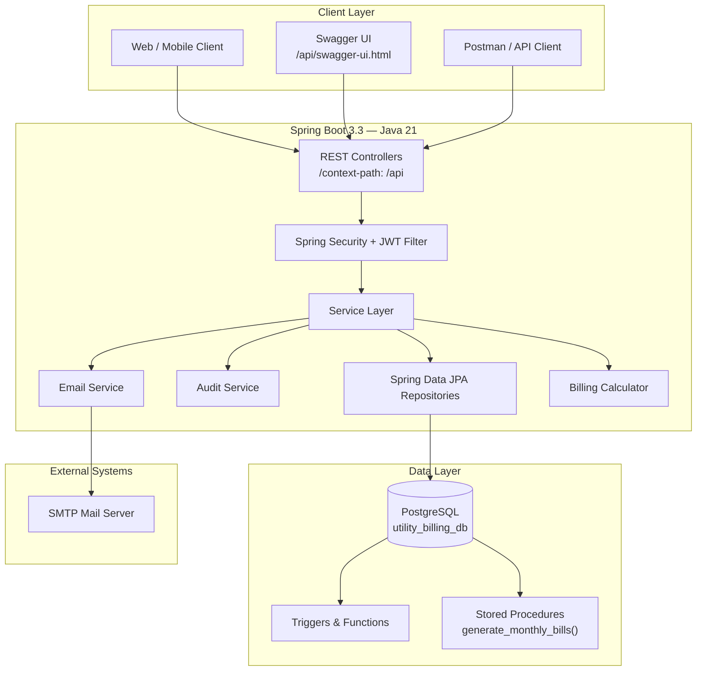

---

## 2. Layered Application Architecture

```mermaid
flowchart TD
    subgraph Presentation["Presentation Layer"]
        AC[AuthController]
        UC[UserController]
        CC[CustomerController]
        MC[MeterController]
        RC[MeterReadingController]
        TC[TariffController]
        BC[BillController]
        PC[PaymentController]
        NC[NotificationController]
        AUC[AuditController]
    end

    subgraph Security["Security Layer"]
        JWT[JwtAuthenticationFilter]
        JTP[JwtTokenProvider]
        CDS[CustomUserDetailsService]
        SC[SecurityConfig]
    end

    subgraph Business["Business / Service Layer"]
        AS[AuthService]
        US[UserService]
        CS[CustomerService]
        MS[MeterService]
        RS[MeterReadingService]
        TS[TariffService]
        BS[BillService]
        PS[PaymentService]
        NS[NotificationService]
        ES[EmailService]
        AU[AuditService]
    end

    subgraph Mapping["Mapper Layer"]
        MAP[UserMapper, CustomerMapper,\nBillMapper, TariffMapper, ...]
    end

    subgraph Persistence["Persistence Layer"]
        UR[UserRepository]
        CR[CustomerRepository]
        MR[MeterRepository]
        RR[MeterReadingRepository]
        TR[TariffRepository]
        BR[BillRepository]
        PR[PaymentRepository]
        NR[NotificationRepository]
        AR[AuditLogRepository]
    end

    subgraph Domain["Domain / Entity Layer"]
        ENT[User, Customer, Meter,\nMeterReading, Tariff, TariffTier,\nBill, Payment, Notification, AuditLog]
    end

    subgraph CrossCutting["Cross-Cutting"]
        GEH[GlobalExceptionHandler]
        APR[ApiResponse Wrapper]
        VAL[Jakarta Validation]
        OAPI[OpenApiConfig / Swagger]
    end

    AC & UC & CC & MC & RC & TC & BC & PC & NC & AUC --> SEC
    SEC --> JWT --> CDS
    AC & UC & CC & MC & RC & TC & BC & PC & NC & AUC --> AS & US & CS & MS & RS & TS & BS & PS & NS & AU
    US --> ES
    AS & US & CS & MS & RS & TS & BS & PS & NS --> MAP
    AS & US & CS & MS & RS & TS & BS & PS & NS & AU --> UR & CR & MR & RR & TR & BR & PR & NR & AR
    UR & CR & MR & RR & TR & BR & PR & NR & AR --> ENT
```

---

## 3. Module / Package Structure

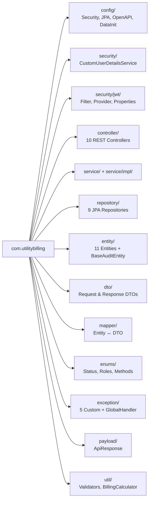

---

## 4. Security & JWT Authentication Flow

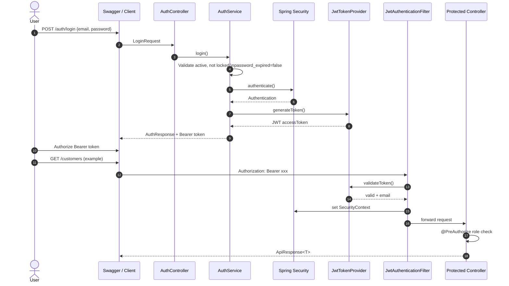

---

## 5. Admin User Creation & First Login Flow

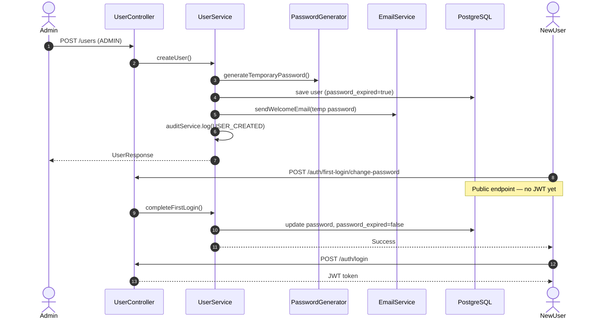

---

## 6. Core Billing Business Flow

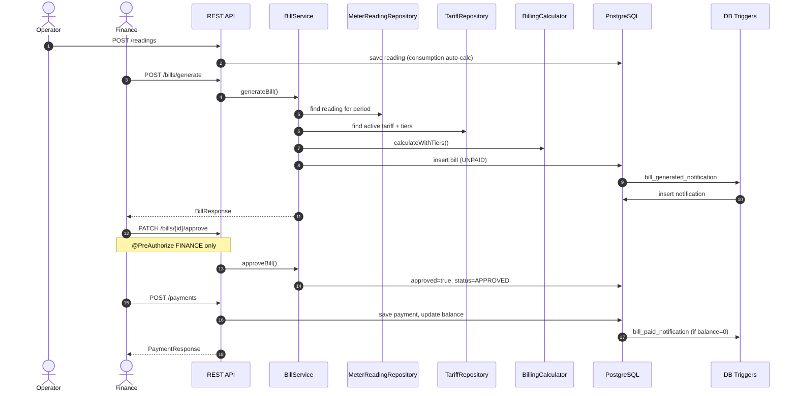

---

## 7. Role-Based Access Control (RBAC)

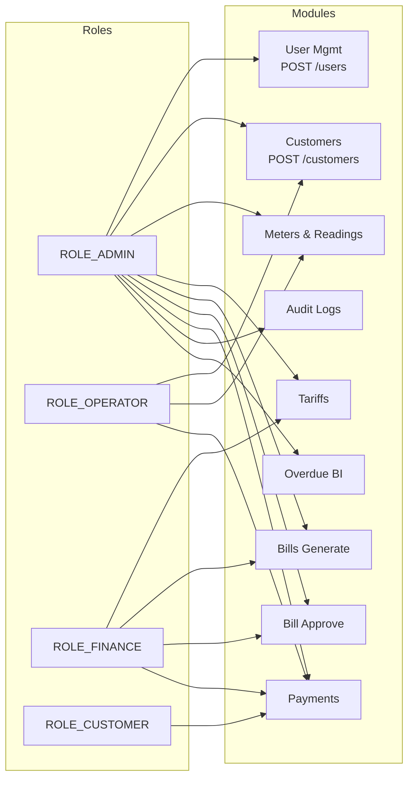

---

## 8. Database Architecture

```mermaid
erDiagram
    USERS ||--o{ USER_ROLES : has
    ROLES ||--o{ USER_ROLES : assigned
    CUSTOMERS ||--|| METERS : owns_1_to_1
    METERS ||--o{ METER_READINGS : records
    TARIFFS ||--o{ TARIFF_TIERS : contains
    TARIFFS ||--o{ BILLS : priced_by
    CUSTOMERS ||--o{ BILLS : receives
    METERS ||--o{ BILLS : billed_on
    BILLS ||--o{ PAYMENTS : paid_by
    CUSTOMERS ||--o{ NOTIFICATIONS : notified

    USERS {
        bigint id PK
        string first_name
        string last_name
        string email UK
        boolean password_expired
        boolean account_locked
    }

    CUSTOMERS {
        bigint id PK
        string national_id UK
        date date_of_birth
        string status
    }

    METERS {
        bigint id PK
        string meter_number UK
        bigint customer_id UK_FK
        string status
    }

    TARIFF_TIERS {
        bigint id PK
        bigint tariff_id FK
        decimal min_units
        decimal max_units
        decimal rate_per_unit
    }

    BILLS {
        bigint id PK
        string bill_number UK
        boolean approved
        string bill_status
        decimal balance
    }

    AUDIT_LOGS {
        bigint id PK
        string actor_email
        string action_type
        string entity_type
    }
```

---

## 9. PostgreSQL Database Routines

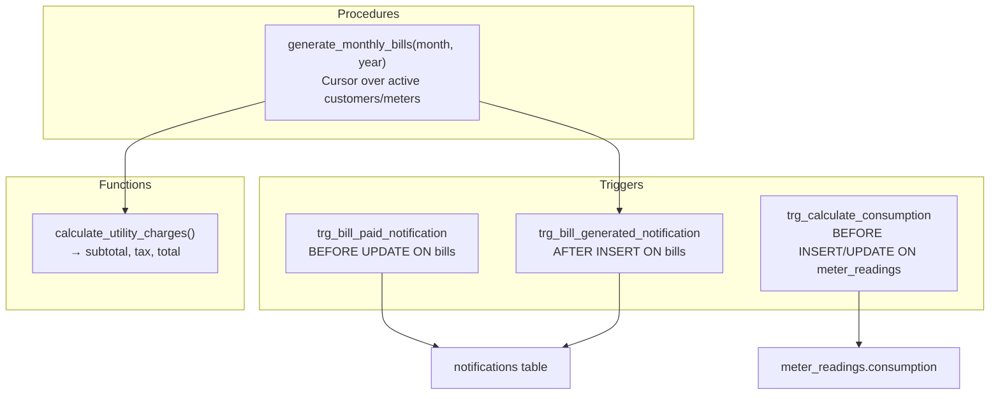

---

## 10. Deployment Architecture

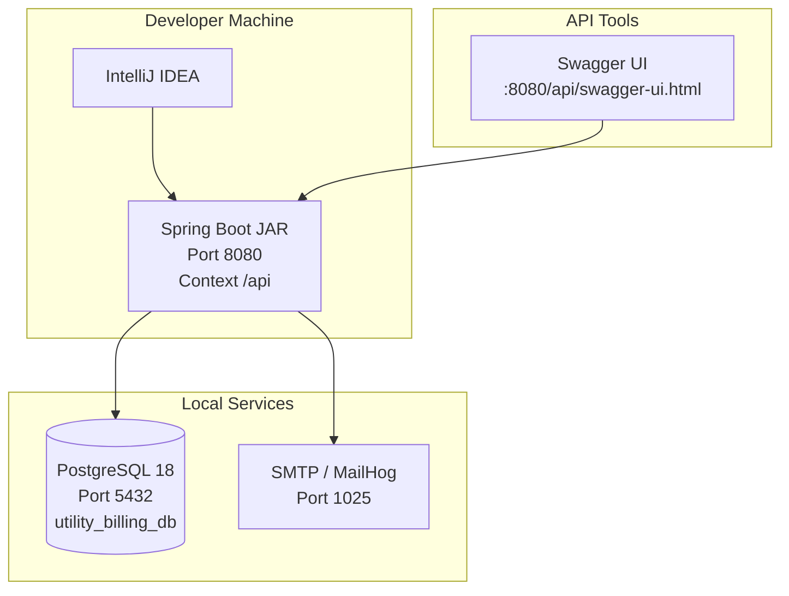

---

## 11. Request/Response Pipeline

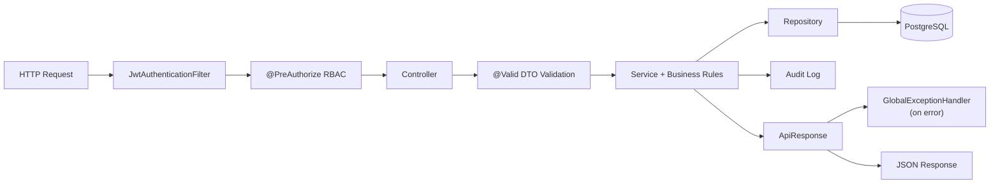

---

## 12. PlantUML — Component Diagram (alternative)

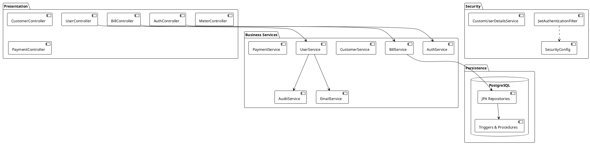

---

## 13. PlantUML — Deployment Diagram

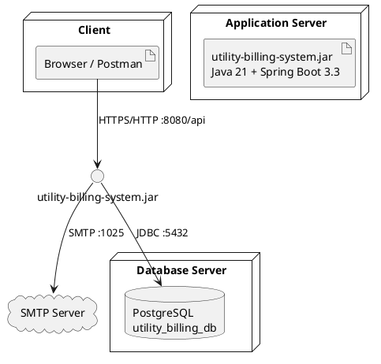

---

## Tools to Render These Diagrams

| Tool | URL | Format |
|------|-----|--------|
| Mermaid Live | https://mermaid.live | `.mmd` / paste code |
| draw.io | https://app.diagrams.net | Insert → Mermaid |
| PlantUML | https://www.plantuml.com/plantuml | PlantUML blocks |
| VS Code | Mermaid / PlantUML extensions | `.md` files |
| GitHub | Push this `.md` file | Auto-renders Mermaid |
